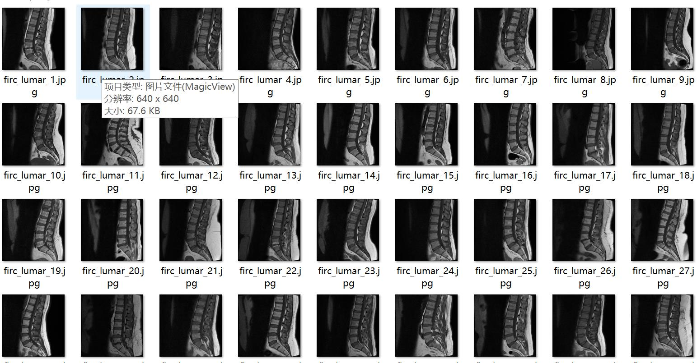
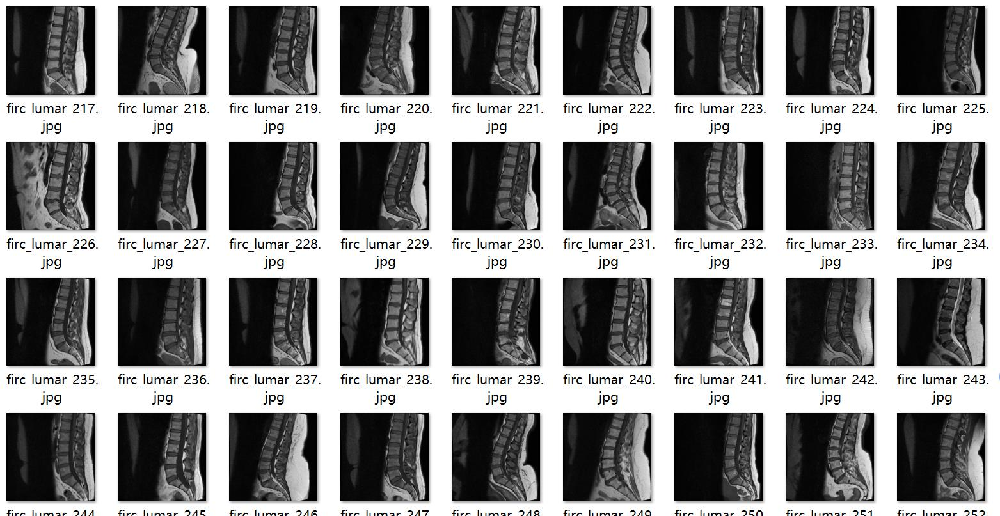
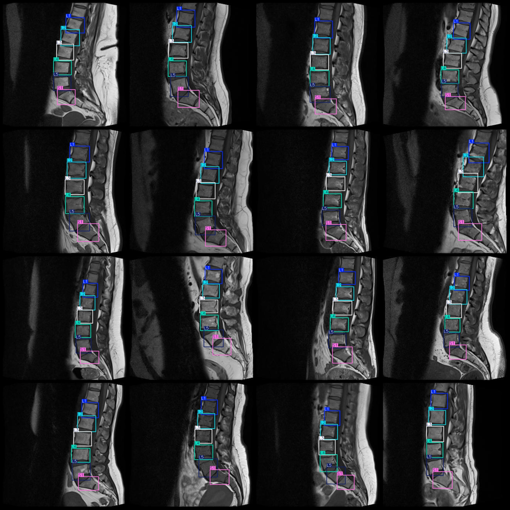
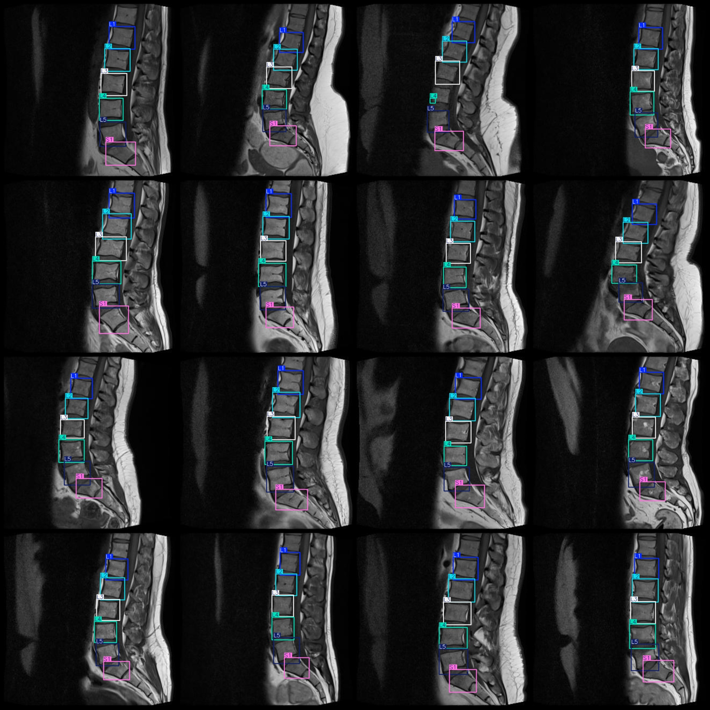

# Smart Medical MRI Image Lumbar Spine Vertebrae Detection Dataset VOC+YOLO Format with 514 Images and 6 Categories

Dataset Format: Pascal VOC format + YOLO format (txt file without split path, only containing jpg images as well as corresponding VOC format xml files and YOLO format txt files)
Image Count (number of jpg files): 514
Annotation Count (number of xml files): 514
Annotation Count (number of txt files): 514
Number of Classification Categories: 6
Classification Category Names (please note that the order of categories in the YOLO format is different from this, but refer to the labels folder "classes.txt" for consistency): ["L1", "L2", "L3", 
"L4", "L5", "S1"]
Number of Boxes per Category:
- L1 boxes = 513
- L2 boxes = 514
- L3 boxes = 514
- L4 boxes = 514
- L5 boxes = 514
- S1 boxes = 514
Total Boxes: 3083
Number of Images Each Category Occupies:
- L1 occupies images = 513
- L2 occupies images = 514
- L3 occupies images = 514
- L4 occupies images = 514
- L5 occupies images = 514
- S1 occupies images = 514
Image Resolution: 640x640
Annotation Tool Used: labelImg
Annotation Rules: Draw a box around the category
Important Notice: The dataset does not have been divided into training, validation, or testing sets; you will need to divide it yourself.
Special Declaration: This dataset does not guarantee any accuracy on the trained models or weight files.
Image Preview:
Annotation Example:

## Images

Here is a pay link on Stripe ( https://buy.stripe.com/3cs8yP7sY87d0vu9AB ). Please contact me lonlonago@foxmail.com after funding $89, and I will send you a complete data files , thank you!

